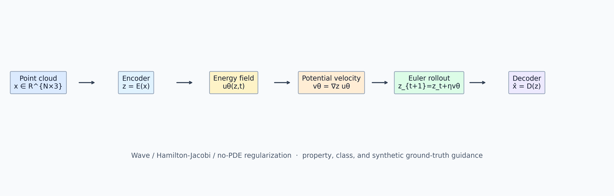
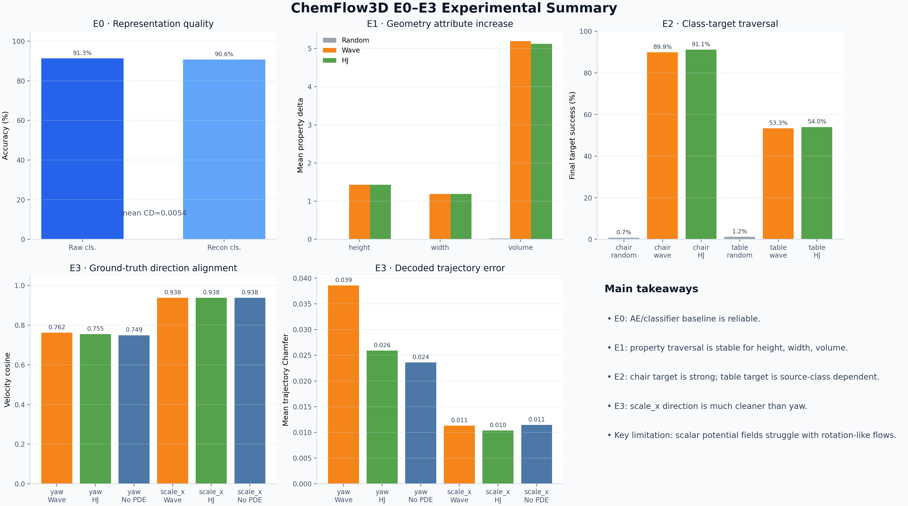
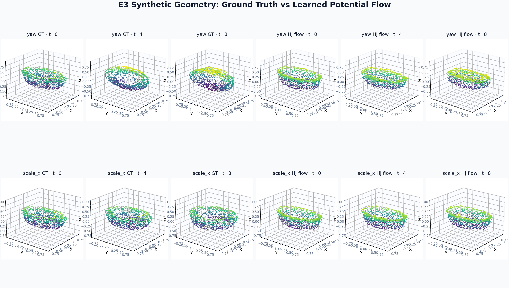

# ChemFlow3D: Latent Flows for 3D Point Clouds


## 本项目的算法贡献点

ChemFlow3D 是一个将 ChemFlow-style latent flow 迁移到 3D 点云模态的实验项目。项目以 ModelNet10 为主要数据集，先训练点云自编码器与分类器，再在 latent space 中学习可控流场，用于几何属性编辑、目标类别迁移，以及带 ground truth 的合成几何变换诊断，形成了一个清晰实验框架：

1. 将 ChemFlow/PoFlow 的 potential flow 迁移到 3D point-cloud latent space；
2. 同时覆盖 property、class、ground-truth synthetic dynamics 三类任务；
3. 用 E3 明确区分“latent direction 学到了”和“decoded geometry 是否真实”；
4. 用 yaw vs scale_x 对比初步揭示 potential flow 的无旋限制；
   


## 当前结论

| 阶段 | 任务 | 结论 |
|---|---|---|
| E0 | 点云 AE 与分类器基线 | 通过。mean Chamfer=0.00544，重建后分类准确率=90.64% |
| E1 | height / width / volume 属性 flow | 通过。Wave 与 HJ 在三个属性上 positive rate 均为 100% |
| E2 | target class 2 / 8 类别 flow | 基本通过。target=2 成功率约 90%，target=8 约 54% |
| E3 | yaw / scale_x ground-truth 几何方向 | 通过但有差异。scale_x 明确成功，yaw 暴露 potential-flow 表达瓶颈 |





## 方法概览

项目采用三段式流程：

```text
ModelNet10 mesh / point cloud
  -> 采样与归一化
  -> PointNet-style AE 得到 latent code z
  -> 在 latent space 中训练 ChemFlow-style scalar potential / flow
  -> latent ODE rollout
  -> Decoder 生成编辑后的点云
  -> 用几何属性、分类器、GT 序列误差评估
```

当前主线实现包含三类 flow 设定：

- `no-pde`：只学习任务方向，是保留的强基线。
- `wave`：加入 Wave PDE 约束，来自 PoFlow 一类 potential-flow 视角。
- `hj`：加入 Hamilton-Jacobi 形式约束，更接近最短路径/最优控制视角。

从实验结果看，PDE 正则并没有在所有任务上压倒 no-pde。更准确的判断是：ChemFlow-style latent flow 在点云 latent space 中可行，但不同 PDE 对不同几何方向的影响需要继续系统研究。

## 文档入口
包含两篇中文说明文档：

| 文档 | 内容 |
|---|---|
| [docs/01_algorithm_principles_zh.md](docs/01_algorithm_principles_zh.md) | PoFlow / Flow Factorized 与 ChemFlow3D 的算法模型、数学公式、数据流与关系 |
| [docs/02_experiments_e0_e3_zh.md](docs/02_experiments_e0_e3_zh.md) | E0–E3 实验设计、数值结果、可视化现象与总体结论 |

## 项目结构

```text
MXPXAI/
├── chemflow3d/                         # 3D 点云 latent flow 项目代码
│   ├── data/                           # ModelNet10 读取、采样、合成变换序列
│   ├── models/                         # PointNet AE、分类器、flow generator
│   ├── flows/                          # 势能场、PDE loss、latent traversal
│   ├── metrics/                        # 几何属性、轨迹误差、OOD 指标
│   ├── scripts/                        # 训练、评估、可视化入口
│   └── tests/                          # 单元测试
├── chemflow3d_cache/                   # 预处理缓存与合成序列
├── chemflow3d_runs/                    # 训练权重、评估结果、最终图
│   └── final_figures/                  # README 与主文档使用的高级可视化
├── docs/                               # 两篇主线中文文档
                     
```

## 环境

当前开发与测试环境：

```text
conda env: chemflow3d
python: 3.11.13 
OS: Windows / PowerShell
```


## 命令

主线实验命令：
### E0-1：ModelNet10 预处理

```powershell
python -m chemflow3d.scripts.preprocess_modelnet10 `
  --input-root ModelNet10 `
  --output-root chemflow3d_cache/modelnet10_1024 `
  --num-points 1024 `
  --seed 42
```
### E0-2：训练PointNet AE

```powershell
python -m chemflow3d.scripts.train_ae `
  --cache-root chemflow3d_cache/modelnet10_1024 `
  --output chemflow3d_runs/e0_ae `
  --model ae `
  --num-points 1024 `
  --latent-dim 128 `
  --batch-size 32 `
  --epochs 100 `
  --lr 1e-3
```
### E0-3：训练点云分类器

```powershell
python -m chemflow3d.scripts.train_classifier `
  --cache-root chemflow3d_cache/modelnet10_1024 `
  --output chemflow3d_runs/e0_classifier `
  --batch-size 64 `
  --epochs 100 `
  --lr 1e-3
```
### E0-4：评估 AE 与分类器

```powershell
python -m chemflow3d.scripts.eval_e0 `
  --cache-root chemflow3d_cache/modelnet10_1024 `
  --ae-ckpt chemflow3d_runs/e0_ae/best.pt `
  --classifier-ckpt chemflow3d_runs/e0_classifier/best.pt `
  --output chemflow3d_runs/e0_eval
```

### E1-1：几何属性优化

训练 Wave flow：

```powershell
python -m chemflow3d.scripts.train_flow `
  --cache-root chemflow3d_cache/modelnet10_1024 `
  --ae-ckpt chemflow3d_runs/e0_ae/best.pt `
  --output chemflow3d_runs/e1_wave_height `
  --pde wave `
  --guidance height `
  --epochs 50 `
  --step-size 0.1 `
  --lambda-pde 1.0 `
  --lambda-guide 1.0 `
  --lambda-ic 0.1
```
### E1-2：属性 traversal 评估

```powershell
python -m chemflow3d.scripts.eval_traversal `
  --cache-root chemflow3d_cache/modelnet10_1024 `
  --ae-ckpt chemflow3d_runs/e0_ae/best.pt `
  --flow-ckpt chemflow3d_runs/e1_hj_height/best.pt `
  --property height `
  --output chemflow3d_runs/e1_eval_height_hj
```
### E2：目标类别 traversal 训练与评估
示例：目标类别 `table`，ModelNet10 class id 为 8。

```powershell
python -m chemflow3d.scripts.train_flow `
  --cache-root chemflow3d_cache/modelnet10_1024 `
  --ae-ckpt chemflow3d_runs/e0_ae/best.pt `
  --classifier-ckpt chemflow3d_runs/e0_classifier/best.pt `
  --output chemflow3d_runs/e2_wave_to_table `
  --pde wave `
  --guidance class `
  --target-class 8 `
  --epochs 50

python -m chemflow3d.scripts.eval_class_traversal `
  --cache-root chemflow3d_cache/modelnet10_1024 `
  --ae-ckpt chemflow3d_runs/e0_ae/best.pt `
  --classifier-ckpt chemflow3d_runs/e0_classifier/best.pt `
  --flow-ckpt chemflow3d_runs/e2_wave_to_table/best.pt `
  --target-class 8 `
  --output chemflow3d_runs/e2_eval_target_8
```
### E3-1. 构造 synthetic sequence

yaw rotation

```powershell
python -m chemflow3d.scripts.build_synthetic_sequences `
  --cache-root chemflow3d_cache/modelnet10_1024 `
  --output-root chemflow3d_cache/modelnet10_sequences `
  --split train `
  --transform yaw `
  --steps 8
```

scale_x

```powershell
python -m chemflow3d.scripts.build_synthetic_sequences `
  --cache-root chemflow3d_cache/modelnet10_1024 `
  --output-root chemflow3d_cache/modelnet10_sequences `
  --split train `
  --transform scale_x `
  --steps 8
```
### E3-2. 训练 latent flow

Wave PDE

```powershell
python -m chemflow3d.scripts.train_synthetic_flow `
  --sequence-root chemflow3d_cache/modelnet10_sequences `
  --index chemflow3d_cache/modelnet10_sequences/index_train_yaw.json `
  --ae-ckpt chemflow3d_runs/e0_ae/best.pt `
  --output chemflow3d_runs/e3_wave_yaw `
  --pde wave `
  --epochs 50 `
  --batch-size 16 `
  --lambda-velocity 1.0 `
  --lambda-direction 0.1 `
  --lambda-pde 0.1
```
### E3-3：合成几何方向评估

```powershell
python -m chemflow3d.scripts.eval_synthetic_flow `
  --sequence-root chemflow3d_cache/modelnet10_sequences `
  --index chemflow3d_cache/modelnet10_sequences/index_test_scale_x.json `
  --ae-ckpt chemflow3d_runs/e0_ae/best.pt `
  --flow-ckpt chemflow3d_runs/e3_hj_scale_x/best.pt `
  --output chemflow3d_runs/e3_eval_scale_x
```

### 最终可视化

```powershell
python -m chemflow3d.scripts.visualize_final_report `
  --ae-ckpt chemflow3d_runs/e0_ae/best.pt `
  --output chemflow3d_runs/final_figures
```

生成结果：

- `fig_01_framework.png`：算法框架图
- `fig_02_e0_e3_dashboard.png`：E0–E3 总览结果图
- `fig_03_e3_3d_pointcloud_rollouts.png`：yaw 与 scale_x 的 3D 点云 rollout 对比图

## 测试

```powershell
python -m pytest chemflow3d/tests -q
```

当前测试覆盖：

- Chamfer 与几何属性计算
- PDE residual 基本数值逻辑
- E1 flow 训练目标
- E2 类别 traversal 数据流
- E3 synthetic flow 轨迹指标

## 下一步考虑：E4

E4 建议聚焦在当前方法最明确的瓶颈：标量势函数产生的梯度场天然无旋，不适合表达 yaw 这类旋转/环流方向。

建议路线：

1. 加入非势能向量场 `v_\theta(z,t)`，与 `v=∇φ(z,t)` 做严格对比。
2. 尝试 Helmholtz-style 分解：`v = ∇φ + u`，其中 `u` 表示旋转分量。
3. 为 yaw 增加角度误差、循环一致性和 orientation consistency 指标。
4. 系统扫描 PDE 权重、rollout step、velocity norm clipping，明确 PDE 正则到底改善了平滑性、泛化还是数值稳定性。

